# Hands-on with Container Apps

The purpose of this repo is to help you quickly get hands-on with Container Apps. It is meant to be consumed either through GitHub codespaces or through a local Dev Container. The idea being that everything you need from tooling to runtimes is already included in the Dev Container so it should be as simple as executing a run command.

## Activities
  - [Review Scenario](#scenario)
  - [Review Architecture](#architecture)
  - [Ensure Pre-requisites](#pre-requisites)
  - [Getting Started](#getting-started)
  - [Setup Solution](#setup-solution)
  - [Deploy version 1 of the application](#deploy-version-1-of-the-application)
  - [Verify version 1](#verify-version-1)
  - [Troubleshoot version 1](#troubleshoot-version-1)
  - [Deploy Version 2](#deploy-version-2)
  - [Verify Version 2](#verify-version-2)
  - [Troubleshoot Version 2](#troubleshoot-version-2)
  - [Deploy version 3](#deploy-version-3)
  - [Verify version 3](#verify-version-3)
  - [Deploy version 4](#deploy-version-4)
  - [Verify version 4](#verify-version-4)
  - [Deploy version 5](#deploy-version-5)
  - [Version 6, working with API Management](#version-6-working-with-api-management)
  - [Version 7, enable authentication](#deploy-version-7)
  - [Verify version 7](#verify-version-7)
  - [Cleanup](#cleanup)

## Scenario

As a retailer, you want your customers to place online orders, while providing them the best online experience. This includes an API to receive orders that is able to scale out and in based on demand. You want to asynchronously store and process the orders using a queing mechanism that also needs to be auto-scaled. With a microservices architecture, Container Apps offer a simple experience that allows your developers focus on the services, and not infrastructure.

In this sample you will see how to:

1. Deploy the solution and configuration through IaaC, no need to understand Kubernetes
2. Ability to troubleshoot using built-in logging capability with Azure Monitor (Log Analytics)
3. Out of the box Telemetry with Dapr + Azure Monitor (Log Analytics)
4. Ability to split http traffic when deploying a new version
5. Ability to configure scaling to meet usage needs
6. Configure CI/CD deployment to private Azure Container Registry using GitHub Actions


## Architecture
Once this lab is completed you should have an Architecture that looks something like the diagram below.


## Pre-requisites

- A GitHub account
- An Azure Subscription
- License for using GitHub Codespaces


## Getting Started

You will work in a separate fork of this repository in GitHub.

1. Log in to [GitHub](https://github.com) with your GitHub account
2. Fork this repo by selecting the *Fork* menu in the GitHub top right corner

3. After completing the fork, open your repository in GitHub Codespaces by selecting menu Code-->Create codespace on main
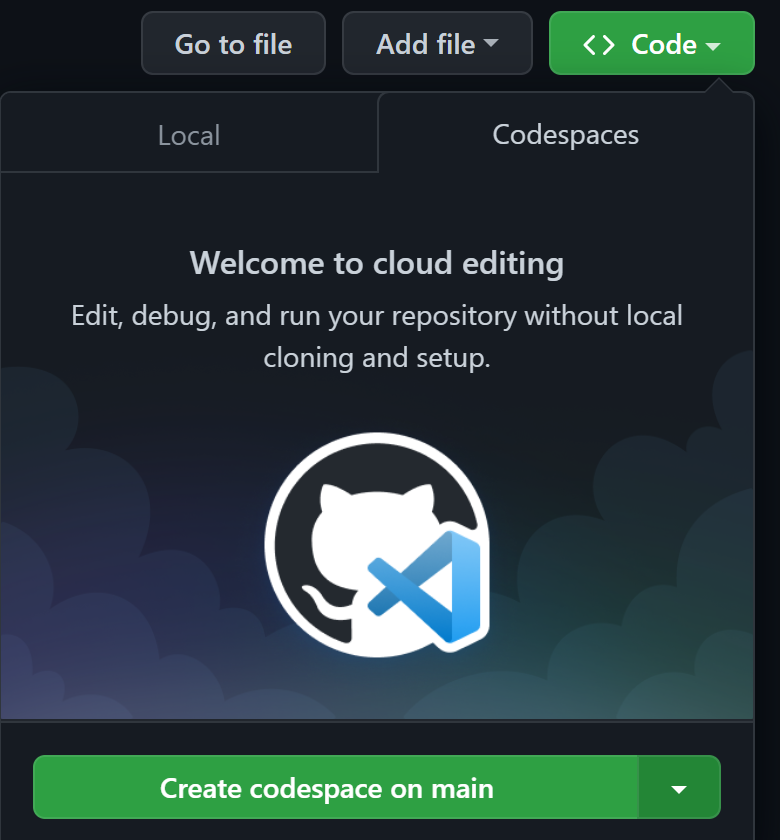

This command will take 5-10 minutes to set up the development container and clone the source code.

Once the Codespaces finished deployment you will have a browser based VSCode instance available with a cloned repository. Take a few minutes to familarize yourself with the source code and starter files. 
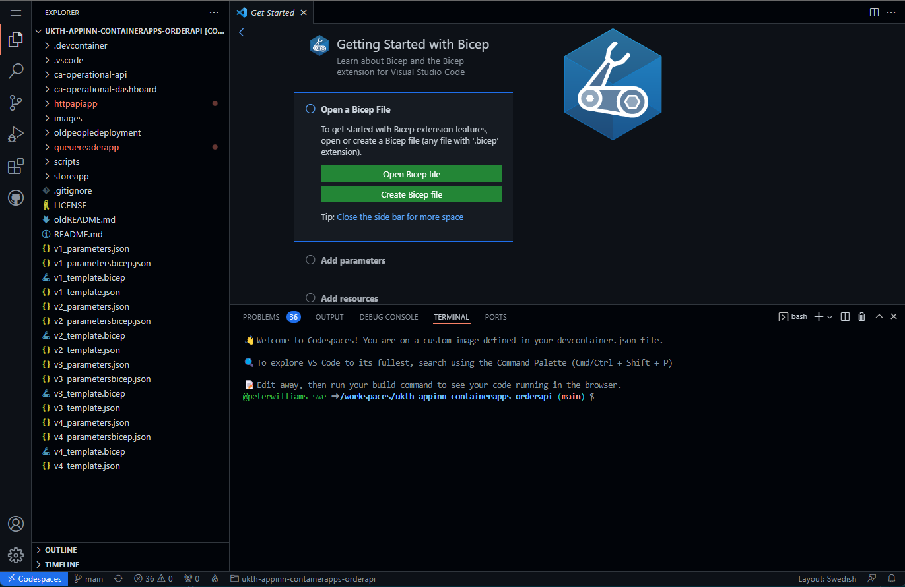

As this is currently a preview service, you will need to install an Azure CLI extension to work with Container Apps.
More information about the azure container apps extension commandos: https://docs.microsoft.com/en-us/cli/azure/containerapp?view=azure-cli-latest

Run the following command.

```bash
az extension add --name containerapp
```

We will be using the `hey` load testing tool later on. If you are using Codespaces, the container includes Homebrew, so you can install `hey` like this:

```bash
brew install hey
```

If you are using an environment other than Codespaces, you can find installation instructions for `hey` here - [https://github.com/rakyll/hey](https://github.com/rakyll/hey)

## Setup Solution

Let's start by setting some variables that we will use for creating Azure resources in this demo, and a resource group for those resources to reside in.

```bash
# Generate a random name
name=ca$(cat /dev/urandom | tr -dc '[:lower:]' | fold -w ${1:-5} | head -n 1)

# Set variables for the rest of the demo
resourceGroup=${name}-rg
location=northeurope
containerAppEnv=${name}-env
logAnalytics=${name}-la
appInsights=${name}-ai
acr=${name}acr
```

Optional -  if using Codespaces or not logged into Azure CLI

```bash
# Login into Azure CLI
az login --use-device-code

# Check you are logged into the right Azure subscription. Inspect the name field
az account show

# In case not the right subscription
az account set -s <subscription-id>

```

```bash
# Create Resource Group
az group create --name $resourceGroup --location $location -o table
```

## Deploy version 1 of the application

We'll deploy the first version of the application to Azure. 

Review the [V1 Bicep template](v1_template.bicep) that contains IaC definitions for Azure Container Apps Environment and other related services such as Log Analytics and a Storage account for the queue. Notice the individual container app resources 

```bash
az deployment group create \
  -g $resourceGroup \
  --template-file v1_template.bicep \
  --parameters @v1_parametersbicep.json \
  --parameters \
    ContainerApps_Environment_Name=$containerAppEnv \
    LogAnalytics_Workspace_Name=$logAnalytics \
    AppInsights_Name=$appInsights \
    Container_Registry_Name=$acr 
```
This typically takes around 3 to 5 minutes to complete.

Once deployment has completed, verify the resources created by navigating to [Azure Portal](https://portal.azure.com). The following resources should be created. Note that the resource name prefix will differ in your environment.
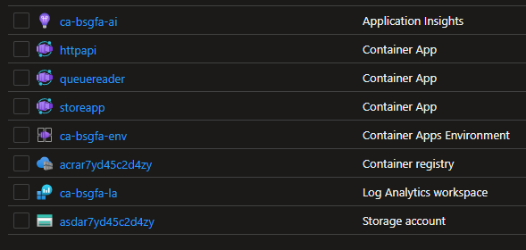

Select the Container Apps Environment and review the apps listed in the Apps blade
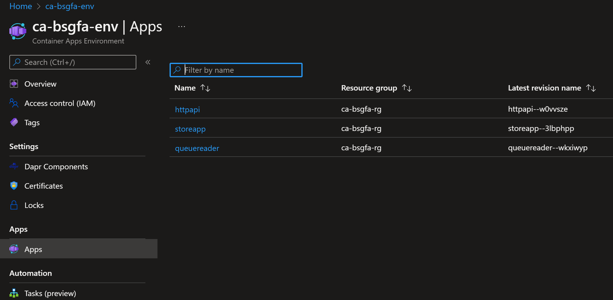

## Verify version 1 
Now the application is deployed, let's verify that it works correctly. First determine the URL we'll use to access the store application and save that in a variable for convenience

```bash
storeURL=https://storeapp.$(az containerapp env show -g $resourceGroup -n $containerAppEnv --query 'properties.defaultDomain' -o tsv)/store
```

Let's see what happens if we call the URL of the store with curl.

> Alternatively, you can run `echo $storeURL` to get the URL for the application and then open that in a browser.

```bash
curl $storeURL
```

The response you should see is `[]` which means no data was returned. Either there has been no orders submitted or something's not working correctly.

Try adding a new order to the order data API and verify that it is stored correctly. First grab the order data API URL using a similar approach as in previous step.

```bash
dataURL=https://httpapi.$(az containerapp env show -g $resourceGroup -n ${name}-env --query 'properties.defaultDomain' -o tsv)/Data
```
Add a new order test item using a HTTP Post

```bash
curl -X POST $dataURL?message=item1
```
Verify that the store API returns the order

```bash
curl $storeURL
```

Still no orders are returned. 

Finally, check the queue length using the data API
```bash
curl $dataURL
```
You should see the following output indicating that the queue is not read correctly.
> `Queue 'demoqueue' has 1 message`

Let's do some troubleshooting.

## Troubleshoot version 1 

ContainerApps integrates with Application Insights and Log Analytics. In the Azure Portal, go to the Log Analytics workspace in the resource group we're using for this demo and run the following query to view the logs for the `queuereader` application.

```text
ContainerAppConsoleLogs_CL
| where ContainerAppName_s has "queuereader" and ContainerName_s has "queuereader"
| top 100 by TimeGenerated
```
> If you don't see any results from the query you need to wait a couple of minutes for logs to be populated.


You should see a some log entries that will likely contain the same information about the error. Drill down on one of them to reveal more. You should see something like the following:
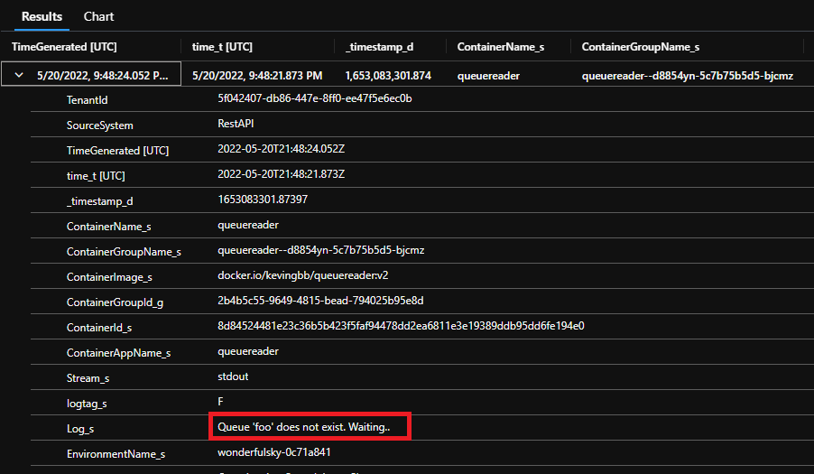
> "Log_s": "      Queue 'foo' does not exist. Waiting..",

Looks like we have configured the wrong name for the queue. So, we've gone ahead and made the necessary changes to our bicep code [V2 Bicep template](v2_template.bicep) to be used as version 2 of our solution. Let's deploy version 2.

## Deploy version 2

We'll repeat the deployment command from earlier, but we've updated our template to use version 2 of the configuration.

```bash
az deployment group create \
  -g $resourceGroup \
  --template-file v2_template.bicep \
  --parameters @v2_parametersbicep.json \
  --parameters ContainerApps_Environment_Name=$containerAppEnv \
    LogAnalytics_Workspace_Name=$logAnalytics \
    AppInsights_Name=$appInsights 

```
## Verify Version 2 

Let's see what happens when we access the queue application using the data URL

> As before, you can type `echo $dataURL` to get the URL of the HTTP API and then open it in a browser if you prefer

``` bash
curl $dataURL
```

The result tells us that `demoqueue` has no messages:

> `Queue 'demoqueue' has 0 messages`

This indicates that the messages are now processed. Now add another test message.

```bash
curl -X POST $dataURL?message=item2
```

Ok, let's check our Store URL and see what happens this time

```bash
curl $storeURL
```

> `[{"id":"a85b038a-a01f-4f25-b468-238d0c8a3676","message":"24a1f5ed-2407-4f9d-a6f9-5664436f1c28"},{"id":"f2b4c93a-63e5-4a4d-8a66-1fa4d4b958fe","message":"5940cf24-8c55-4b38-938a-10d9351d5d2b"}]`

Ok, that's some progress but not the messages we sent in the query string. 
## Troubleshoot version 2 
Let's take a look at the application code


**DataController.cs**

```c#
...
  [HttpPost]
  public async Task PostAsync()
  {
      try
      {
          await queueClient.SendMessageAsync(Guid.NewGuid().ToString());

          Ok();
      }
...
```

It looks like the code is set to send a GUID, not the message itself. Must have been something the developer left in to test things out. The correct code should look like this:

**DataController.cs** (version 2)

```c#
  [HttpPost]
  public async Task PostAsync(string message)
  {
      try
      {
          await queueClient.SendMessageAsync(DateTimeOffset.Now.ToString() + " -- " + message);

          Ok();
      }
```

We've now fixed the code so that the message received is now actually being sent and we've packaged this up into a new container ready to be redeployed.

But maybe we should be cautious and make sure this new change is working as expected. Let's perform a controlled rollout of the new version and split the incoming network traffic so that only 20% of requests will be sent to the new version of the application.

To implement the traffic split, in v3_template.bicep add the traffic section on your httpapi app and save the file.
```json
  ingress: {
        external: true
        targetPort: 80
        traffic: [
          {
            revisionName: 'httpapi--${ContainerApps_HttpApi_CurrentRevisionName}'
            weight: 80
          }
          {
            latestRevision: true
            weight: 20
          }
        ]
      }
```

Effectively, we're asking for 80% of traffic to be sent to the current version (revision) of the application and 20% to be sent to the new version that's about to be deployed.

## Deploy version 3

Once again, let's repeat the deployment command from earlier, now using version 2 of the HTTP API application and with traffic splitting configured

```bash
az deployment group create \
  -g $resourceGroup \
  --template-file v3_template.bicep \
  --parameters @v3_parametersbicep.json \
  --parameters ContainerApps_Environment_Name=$containerAppEnv \
    LogAnalytics_Workspace_Name=$logAnalytics \
    AppInsights_Name=$appInsights 
```
## Verify version 3
With the third iteration of our applications deployed, let's try and send another order.

```bash
curl -X POST $dataURL?message=item3
```

And let's check the Store application again to see if the messages have been received

```bash
curl $storeURL | jq
```

```json
[
   {
    "id": "b222d3fd-9776-4631-9f1d-5038055e1541",
    "message": "fa7c4a50-a711-48d5-8d7c-b9a9e9b9056e"
  },
  {
    "id": "807fd951-7213-4fd7-8a6f-df3a8e064ed9",
    "message": "05/20/2022 22:31:26 +00:00 -- item3"
  },
]
```

> Note that the traffic split is 80/20 (80% old api, 20 % new api), so you might need to send a few messages before it hits our new revision of httpapi and appends the provided string to the message.

That's looking better. We can still see the original message, but we can also now see our "item3" message with the date and time appended to it.

We configured traffic splitting, so let's see that in action. First we will need to send multiple messages to the application. We can use the load testing tool `hey` to do that.

```bash
hey -m POST -n 25 -c 1 $dataURL?message=hello
```

```bash
curl $storeURL | jq
```

Let's check the application logs for the Queue Reader application

```text
ContainerAppConsoleLogs_CL
| where ContainerAppName_s has "queuereader" and ContainerName_s has "queuereader"
| where Log_s has "Message"
| project TimeGenerated, Log_s
| order by TimeGenerated desc
```

Looking through those logs, you should see a mix of messages, with some containing "hello" and others still containing a GUID. It won't be exact, but roughly one out of every five messages should contain "hello".

So, is our app ready for primetime now? Let's change things so that the new app is now receiving all of the traffic, plus we'll also setup some scaling rules. This will allow the container apps to scale up when things are busy, and scale to zero when things are quiet.

## Deploy version 4

One additional time, we'll now deploy the new configuration with scaling configured. We will also add a simple dashboard for monitoring the messages flow.

```bash
az deployment group create \
  -g $resourceGroup \
  --template-file v4_template.bicep \
  --parameters @v4_parametersbicep.json \
  --parameters ContainerApps_Environment_Name=$containerAppEnv \
    LogAnalytics_Workspace_Name=$logAnalytics \
    AppInsights_Name=$appInsights 
```

First, let's confirm that all of the traffic is now going to the new application

```bash
hey -m POST -n 10 -c 1 $dataURL?message=testscale
```
## Verify version 4

Let's check the number of orders in the queue

```bash
curl $dataURL
```

As before, we can check the application log files in Log Analytics to see what messages are being received

```text
ContainerAppConsoleLogs_CL
| where ContainerAppName_s has "queuereader" and ContainerName_s has "queuereader"
| where Log_s has "Message"
| project TimeGenerated, Log_s
| order by TimeGenerated desc
```

Now let's see scaling in action. To do this, we will generate a large amount of messages which should cause the applications to scale up to cope with the demand.

> [Optional] While the scaling script is running, you can also have this operations dashboard open to visually see the messages flowing through queue into the store

> ```bash
> dashboardURL=https://dashboardapp.$(az containerapp env show -g $resourceGroup -n ${name}-env --query 'properties.defaultDomain' -o tsv)
> echo 'Open the URL in your browser of choice:' $dashboardURL
> ```

To demonstrate this, a script that uses the `tmux` command is provided in the `scripts` folder of this repository. Run the following commands:

```bash
cd scripts
./appwatch.sh $resourceGroup $dataURL
```

This will split your terminal into four separate views.

* On the left, you will see the output from the `hey` command. It's going to send 10,000 requests to the application, so there will be a short delay, around 20 to 30 seconds, whilst the requests are sent. Once the `hey` command finishes, it should report its results.
* On the right at the top, you will see a list of the container app versions (revisions) that we've deployed. One of these will be the latest version that we just deployed. As `hey` sends more and more messages, you should notice that one of these revisions of the app starts to increase its replica count
* Also on the right, in the middle, you should see the current count of messages in the queue. This will increase to 10,000 and then slowly decrease as the app works it way through the queue.

Once `hey` has finished generating messages, the number of instances of the HTTP API application should start to scale up and eventually max out at 10 replicas. After the number of messages in the queue reduces to zero, you should see the number of replicas scale down and return to 1.

> Tip! To exit from tmux when you're finished, type `CTRL-b`, then `:` and then the command `kill-session`

## Deploy version 5

Until now we have worked with docker images that others have created, now we are going to do a code change on our own code base and push the changes to Container Apps using GitHub Actions. [Learn more](https://docs.microsoft.com/en-us/azure/container-apps/github-actions-cli?tabs=bash)

We are now going to use a Azure CLI command to create a GitHub Action that builds the queuereader C# project and pushes the image to Azure Container Registry and deploys it to our Container App.

First, we need to create a service principal that can be used from the GitHub action to deploy the changes we are introducing.

```bash
az ad sp create-for-rbac \
  --name <SERVICE_PRINCIPAL_NAME> \
  --role "contributor" \
  --scopes /subscriptions/<SUBSCRIPTION_ID>/resourceGroups/<RESOURCE_GROUP_NAME> \
  --sdk-auth
```
The return value from this command is a JSON payload, which includes the service principal's `tenantId`, `clientId`, and `clientSecret`.

Set the variables in bash.

```bash
spClientid=[Replace with the clientId of the service principal]
spClientSecret=[Replace with the clientSecret of the service principal]
tenantid=[Replace with the tenantId of the service principal]
```
Now we need to get information about the Azure Container Registry that we created in the beginning.

Set the variables in bash.
```bash
acrUrl=$(az acr show -n $acr -g $resourceGroup --query 'loginServer' -o tsv)
acrUsername=$(az acr show -n $acr -g $resourceGroup --query 'name' -o tsv)
acrSecret=$(az acr credential show -n $acr -g $resourceGroup --query passwords[0].value -o tsv)
```

Now we need a GitHub Personal Access Token (PAT) so we can authenticate against GitHub from Azure CLI.

Go to github.com --> Settings --> Developer Settings --> Personal access tokens Click on ”Generate new token” button.
 
Password prompt might appear. Enter password.

In the “Note” textbox enter a name for the PAT, such as “ca-pat”.
Give the PAT the following scopes: 
-	repo (Full control of private repositories) 
-	workflows (Update GitHub Action workflows)

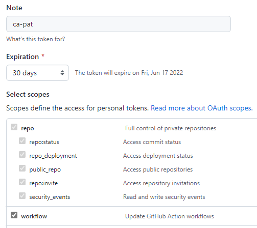


Click “Generate token”, copy the generated token and assign the variable. 
```bash
ghToken=[Replace with the PAT]
```
Set the "repoUrl" variable, replace <OWNER> with the GitHub account name. 
```bash
repoUrl=https://github.com/<OWNER>/ukth-appinn-containerapps-orderapi
```
Now all the variables are set so we can run the Azure CLI command, make sure you are located at the root of the repo and run the following command.

```bash
az containerapp github-action add \
  --repo-url $repoUrl \
  --context-path "./queuereaderapp/Dockerfile" \
  --branch main \
  --name queuereader \
  --resource-group $resourceGroup \
  --registry-url $acrUrl \
  --registry-username $acrUsername \
  --registry-password $acrSecret \
  --service-principal-client-id $spClientid \
  --service-principal-client-secret $spClientSecret \
  --service-principal-tenant-id $tenantid \
  --token $ghToken
```

The command will create a GitHub Action and run it, it takes a couple of minutes, please check the status at github.com --> Actions and see the progress of the GitHub Action after it has been created by the Azure CLI command.

Dive into the logs and locate the “latestRevisionName”, then go to the Azure portal and verify that the revision name is the same for the “queuereader” Container App.

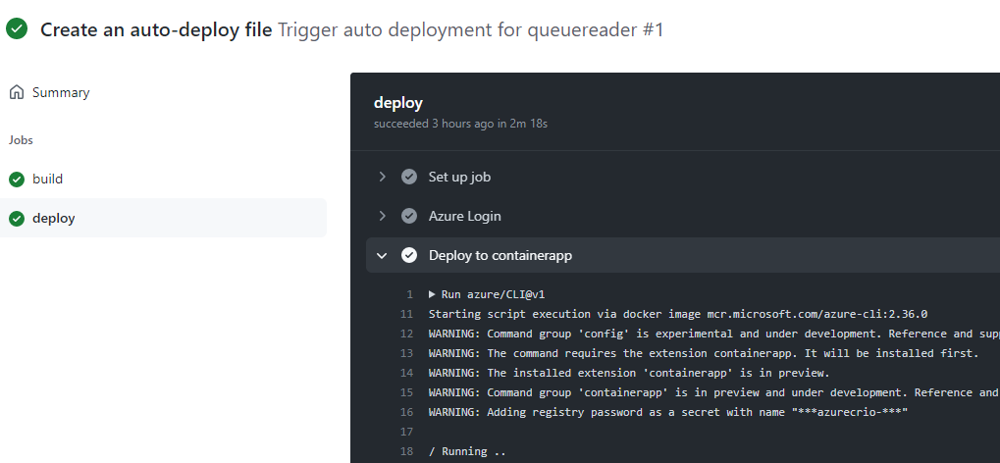

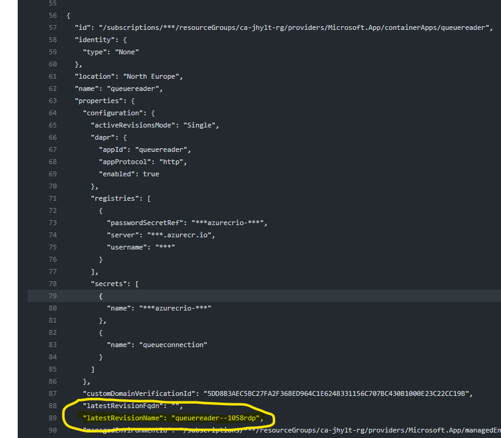

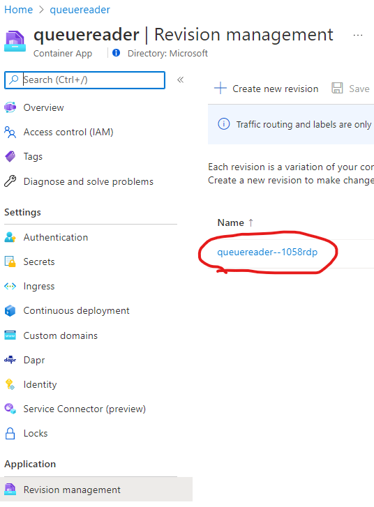


Now it’s time to do a code change and validate that it has been deployed.

Open VS Code --> queuereaderapp folder --> Open Worker.cs and scroll down to line number 51, where we are writing to the log.  

```c#
logger.LogInformation($"Message ID: '{message.MessageId}', contents: '{message.Body?.ToString()}'");
```
Below this line insert the following code.

```c#
logger.LogInformation("This is a new log message!");
```
Then open the Terminal in VS Code and make sure you are in the “queuereaderapp” folder. Run this command.
```bash
dotnet build . 
```
Make sure that the build was succeeded.

Commit the change in VS Code.

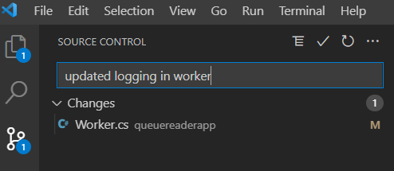

After the commit, the previous created GitHub Action starts, follow the progress at github.com --> Actions.

After the deployment has succeeded, please verify that the revision number has changed using the Azure portal.

Now it’s time to validate that the changes we made has taken affect. Send a message to the API.

```bash
curl -X POST $dataURL?message=mynewlogmessage
```
Validate the change by looking in Log Analytics.

```text
ContainerAppConsoleLogs_CL
| where ContainerAppName_s has "queuereader" and ContainerName_s has "queuereader"
| where Log_s has "Message"
| project TimeGenerated, Log_s
| order by TimeGenerated desc
| limit 50
``` 

Here you should see one row with the text "This is a new log message!".


## Version 6, working with API Management

Now it's time to protect our "httpapi" behind [API Management self hosted gateway (SHGW)](https://docs.microsoft.com/en-us/azure/api-management/self-hosted-gateway-overview). This will be done by: 
- Create a new Container App "httpapi2" based on the same image used in previous steps.
- Configure an internal ingress for "httpapi2" Container App. 
- Create a new Container App "apim" based on an image provided by Microsoft.
- Configure an external ingress for "apim" Container App.
- Configure an API, operation in API Management and expose the API inside the SHGW.

First API Management must be created using the Developer sku. (Consumption doesn't support SHGW). This takes 30-45 minutes. 

```bash
az deployment group create -g $resourceGroup -f apim.bicep -p apiManagementName=${name}-apim
```

After the script has finished an API Management instance and a SHGW has been created.  
Go to the API Management instance in Azure portal and click on "Gateways" in the menu. A gateway called "gw-01" has been created. Click on the gateway name --> Deployment --> Copy everything in the field called "Token" and set the variable "gwtoken", the value must be inside "" double quotes. 

```bash
gwtoken="[Paste value from the Token field]"
```

In the Azure portal, go to the resource group you have been working with and locate the name of the storageaccount that has been created. Set the storageaccount variable.   

```bash
storageaccount=[Enter the name of the storageaccount]
```

Deploy Container Apps and create API Management configuration. 

```bash
az deployment group create -g $resourceGroup -f v5_template.bicep -p apiManagementName=${name}-apim containerAppsEnvName=$containerAppEnv storageAccountName=$storageaccount selfHostedGatewayToken="$gwtoken"
```

Now API Management SHGW has been deployed as a Container App inside of Container Apps and a new Container App called "httpapi2" has been created with an internal ingress which means that is not exposed to the internet.

API Management has protected the API using an API key so this needs to be retrieved. Got to the Azure portal --> Subscriptions --> Choose the bottom row with the scope "Service" --> on the right click the three dots --> Show/hide keys --> Copy the Primary Key value

```bash
apikey=[Paste the value of the primary key]
```

Retrieve the url of the SHGW in Container Apps.    
```bash
apimURL=https://apim.$(az containerapp env show -g $resourceGroup -n ${name}-env --query 'properties.defaultDomain' -o tsv)/api/data
```

Add a new order by using HTTP POST and add a header used for authenticate against API Management. 
```bash
curl -X POST -H "X-API-Key:$apikey" $apimURL?message=apimitem1
```

Verify that it works in Log Analytics.

```text
ContainerAppConsoleLogs_CL
| where ContainerAppName_s has "queuereader" and ContainerName_s has "queuereader"
| where Log_s has "Message"
| project TimeGenerated, Log_s
| order by TimeGenerated desc
```

## Version 7, enable authentication
Up until now we have allowed anonymous access to the application. Let's protect the Dashboard App web application with Azure AD authentication using the Easy Auth service built into Container Apps. See [Authentication and authorization in Azure Container Apps](https://docs.microsoft.com/en-us/azure/container-apps/authentication) for additional details

Navigate to the Container Dashboard App in [Azure Portal](https://portal.azure.com) and select the Authentication blade.


Select Add Identity provider and select "Microsoft" as the identity provider


>Notice the extensive list of identity provider options available

In the "Add identity provider" page change the name of the identity provider to be prefixed with the unique name generated earlier in the lab. You can find it with the following command

```
echo $name
```
Leave the other options with default values


Select "Next: Permissions".

Accept the default values and click "Add"

The Dashboard App is now configured with Azure AD Authentication.

## Verify version 7
Get the Dashboard URL from the variable stored in a previous step
``` bash
echo $dashboardURL
```

If you don't have that variable available you can get it via the following command
> ```bash
> dashboardURL=https://dashboardapp.$(az containerapp env show -g $resourceGroup -n ${name}-env --query 'properties.defaultDomain' -o tsv)
> echo 'Open the URL in your browser of choice:' $dashboardURL
> ```

Open the Url in a browser. You will be prompted for login similar to this
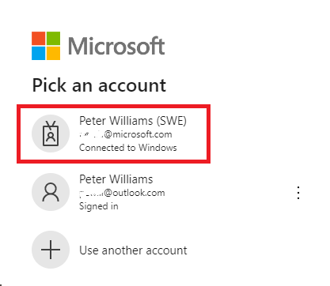
Make sure to select your organizational account if you have several accounts. 
Select login.

Next you will be presented with a consent dialog. 
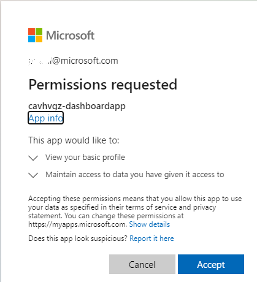

Accept the consent and you will be redirected to the Dashboard App


## Cleanup

Deleting the Azure resource group should remove everything associated with this demo.

```bash
az group delete -g $resourceGroup --no-wait -y
```

## Contributors

* Kevin Harris - kevin.harris@microsoft.com
* Mahmoud El Zayet - mahmoud.elzayet@microsoft.com
* Mark Whitby - mark.whitby@microsft.com
* Anu Bhattacharya - anulekha.bhattacharya@microsoft.com

* Jimmy Karlsson - jimmy.karlsson@microsoft.com
* Jonas Norlund - jonas.norlund@microsoft.com
* Peter Williams - pewill@microsoft.com
* Arash Rassoulpour - arash.rassoulpour@microsoft.com
* Anders Heden - anders.heden@microsoft.com
